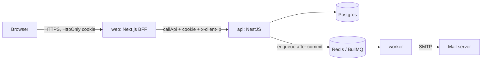
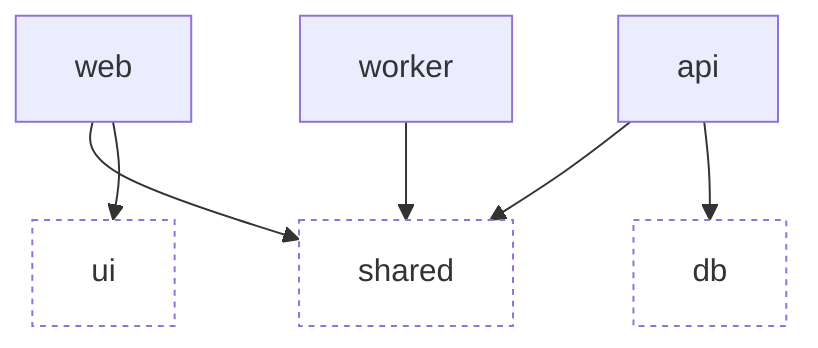

<!--
SCOPE: system components, request flow, package boundaries, configuration, and ports
DOC_KIND: explanation
DOC_ROLE: canonical
READ_WHEN: you need to know where a concern lives or how a request travels
SKIP_WHEN: you need auth details (authentication.md) or a coding convention (AGENTS.md)
PRIMARY_SOURCES: docker-compose.yml, apps/*/src, packages/*/src, turbo.json
-->

# Architecture overview

## Components

| Component              | Tech                                         | Responsibility                                                                                                     |
| ---------------------- | -------------------------------------------- | ------------------------------------------------------------------------------------------------------------------ |
| `apps/web`             | Next.js 16 App Router, React 19, Tailwind v4 | UI and Backend-for-Frontend. Server Components read, Server Actions mutate. The only process the browser talks to. |
| `apps/api`             | NestJS 11 (Express, ESM, SWC)                | Business rules, persistence, authentication, OpenAPI. Private network only.                                        |
| `apps/worker`          | NestJS application context + BullMQ          | Consumes queues (transactional email). Exposes only health probes.                                                 |
| `packages/shared`      | Zod 4                                        | Request, response, error, and queue contracts shared by every app.                                                 |
| `packages/db`          | Drizzle ORM + node-postgres                  | Schema, SQL migrations, `createDatabase()`, migration runner.                                                      |
| `packages/ui`          | React + Tailwind v4 + CVA                    | Design tokens and accessible primitives.                                                                           |
| Postgres 18            |                                              | Source of truth.                                                                                                   |
| Redis 8                |                                              | BullMQ queues and rate-limit counters.                                                                             |
| SMTP (Mailpit locally) |                                              | Outgoing email.                                                                                                    |

## Request flow

1. The browser submits a form to a Server Action, or requests a page rendered by a Server Component.
2. The web server calls the API through `callApi` (`apps/web/src/lib/api/call.ts`), built on `@lepresk/next-bff-fetch`. It forwards the session cookie plus `x-client-ip` and `x-client-user-agent`.
3. The API validates input with the shared Zod schema, runs one action, and returns a schema-validated response or `{ code, message, meta? }`.
4. When the API issues or clears the session cookie, the web server re-emits it on its own origin (`relaySessionCookie: true`).
5. Writes that trigger email register an after-commit hook; the job reaches Redis only if the transaction commits. The worker re-validates the payload and sends through SMTP.

## Package dependency graph

Apps never import from other apps. `packages/tsconfig` and `packages/eslint-config` are dev-only for every workspace.

## Where each concern lives

| Concern                                                    | Location                                                                                                     |
| ---------------------------------------------------------- | ------------------------------------------------------------------------------------------------------------ |
| HTTP pipeline (validation, serialization, prefix, Swagger) | `apps/api/src/app.factory.ts`                                                                                |
| Error codes, statuses, user copy                           | `packages/shared/src/errors.ts`, `apps/api/src/shared/errors/error-catalog.ts`, `apps/web/src/lib/errors.ts` |
| Sessions and auth                                          | `apps/api/src/modules/auth/`                                                                                 |
| Transactions and after-commit hooks                        | `apps/api/src/shared/db/db.service.ts`                                                                       |
| Rate limiting                                              | `apps/api/src/shared/throttling/`                                                                            |
| Cursor pagination                                          | `apps/api/src/shared/pagination/cursor.ts`                                                                   |
| Queue contracts / producers / consumers                    | `packages/shared/src/queues.ts` / `apps/api/src/shared/queue/` / `apps/worker/src/`                          |
| Route guard (optimistic)                                   | `apps/web/src/proxy.ts`; real check: `requireUser()` in `apps/web/src/lib/session.ts`                        |
| Form handling                                              | `apps/web/src/features/auth/use-action-form.ts`                                                              |

## Configuration

| Rule               | Detail                                                                                                                                                                                                   |
| ------------------ | -------------------------------------------------------------------------------------------------------------------------------------------------------------------------------------------------------- |
| One parser per app | `apps/api/src/config/env.ts`, `apps/worker/src/config/env.ts`, `apps/web/src/lib/env.ts` parse `process.env` once with Zod and fail fast with a readable report. ESLint forbids `process.env` elsewhere. |
| Local files        | Backend apps and `packages/db` read the root `.env`; the web app reads `apps/web/.env.local`. `pnpm setup` creates both from their `.env.example` and generates secrets.                                 |
| Production         | Variables are injected by the platform; no `.env` file is baked into images.                                                                                                                             |
| Browser            | Nothing sensitive uses `NEXT_PUBLIC_`. The API URL (`API_INTERNAL_URL`) is server-only.                                                                                                                  |

## Ports

| Service           | Default     | Configured by                                |
| ----------------- | ----------- | -------------------------------------------- |
| web               | 3000        | `next dev --port 3000` / `PORT` in the image |
| api               | 3001        | `API_PORT`                                   |
| worker health     | 3002        | `WORKER_HEALTH_PORT`                         |
| Postgres          | 5432        | `POSTGRES_PORT` (compose host port)          |
| Redis             | 6379        | `REDIS_PORT` (compose host port)             |
| Mailpit SMTP / UI | 1025 / 8025 | `SMTP_PORT` / `MAILPIT_UI_PORT`              |

When you change a host port, update the matching URL (`DATABASE_URL`, `DATABASE_URL_TEST`, `REDIS_URL`) in `.env`.
